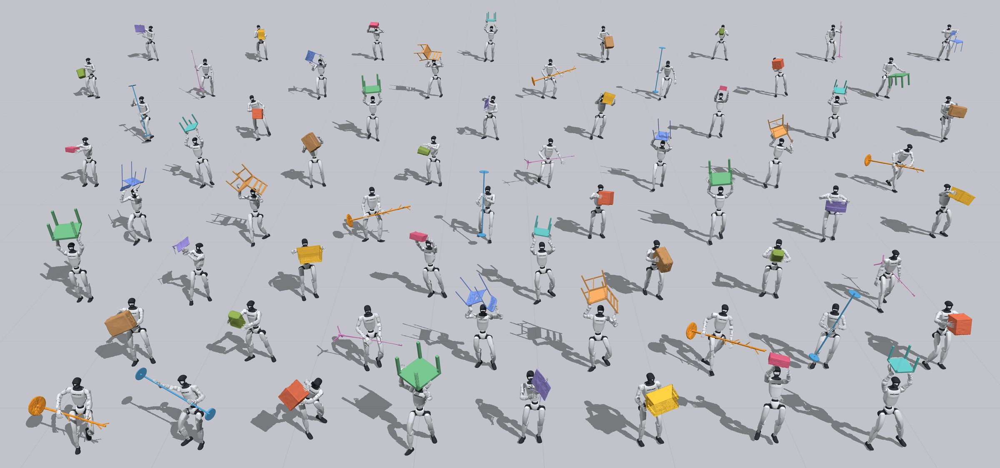
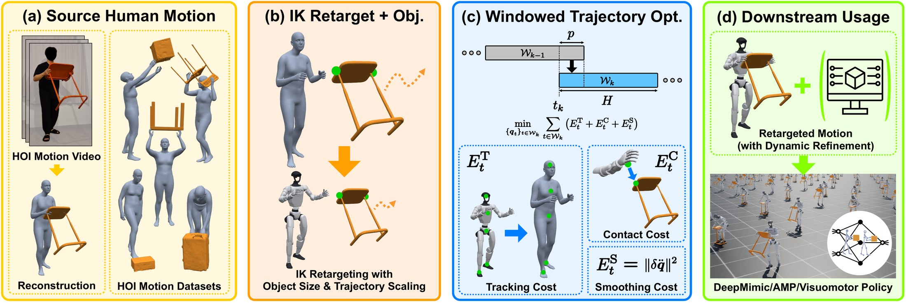

<div align="center">

# HOI-Retarget

**Contact-Centric Retargeting for Human-Object Interaction**

Jihwan Shin · Adrià López Escoriza · Junzhe He · Matthias Heyrman · Marco Hutter<br>
Robotic Systems Lab, ETH Zürich

[](https://shinben0327.github.io/hoi-retarget/)
[](https://huggingface.co/datasets/shinben0327/hoi-retarget)
[](https://huggingface.co/spaces/shinben0327/hoi-retarget-viewer)
[](LICENSE)




</div>

HOI-Retarget turns a human interaction clip — SMPL-X motion, object pose trajectory,
per-body contact labels — into a humanoid trajectory that reproduces the **interaction**,
not just the pose. Every labelled contact is a target in the **object frame**, recovered by
a windowed trajectory optimization, so the robot grasps the same place on the object that
the human did, at any object scale.

On the 13 OMOMO object categories retargeted to a Unitree G1, the mean contact-point gap is
**0.5 cm**, against **18.3 cm** for the closest interaction-aware baseline, at under a
quarter of the compute (both with our object-mesh rescaling disabled, since neither baseline
resizes the mesh — paper, Sec. IV-A).

## Method



**(a)** A captured or video-reconstructed clip supplies human motion, an object trajectory
and contact labels. **(b)** IK retargeting maps the human onto the robot; the object mesh and
trajectory scale by the robot-to-human height ratio, carrying the contact targets with them.
**(c)** A windowed trajectory optimization recovers those contacts under the robot's
kinematic limits. **(d)** The result drives downstream policies.

| Paper | Module | What it does |
|---|---|---|
| Sec. III-A | [`hoi_retarget/retargeting/`](hoi_retarget/retargeting) | IK onto the robot, object mesh and trajectory rescaling, contact targets built in the object frame |
| Sec. III-B | [`hoi_retarget/optimization/`](hoi_retarget/optimization) | Overlapping short-horizon NLPs over the configuration trajectory `q`: tracking + contact + smoothness, under joint position and velocity limits. The object pose is a fixed parameter, never a decision variable |
| Sec. III-C | [`hoi_retarget/contact/`](hoi_retarget/contact) | Viser editor: one draggable point per contact segment, then re-solve from the corrected targets. Never edits the source |

The IK backend is a fork of [GMR](https://github.com/YanjieZe/GMR) in
[`hoi_retarget/gmr/`](hoi_retarget/gmr) (MIT).

## Installation

```bash
conda create -n hoi-retarget python=3.10 -y
conda activate hoi-retarget
conda install -c conda-forge pinocchio casadi parallel -y
pip install -e .
```

Details, EGL rendering and the `HOI_RETARGET_*` path overrides: [`docs/INSTALL.md`](docs/INSTALL.md).

SMPL-X body models and source motions are licensed downloads and are not shipped. Get them
first — [`docs/DATA.md`](docs/DATA.md), or [`docs/INTERACT.md`](docs/INTERACT.md) for the
four InterAct datasets.

## Quickstart

```bash
# one clip
hoi-retarget --input_file data/InterMimic/OMOMO_new/sub10_whitechair_049.pt \
             --out_dir outputs/sub10_whitechair_049

# an OMOMO folder (each clip's object is read from its file name)
hoi-retarget --src_folder data/InterMimic/OMOMO_new --tgt_folder outputs/omomo

# the OMOMO corpus, in parallel, resumable
mkdir -p outputs && find -L data/InterMimic/OMOMO_new -name '*.pt' > outputs/clips.txt
hoi_retarget/tools/batch_retarget.sh outputs/clips.txt outputs/omomo
```

For other sources, run one clip at a time with `--object_model_path`.

Every run writes `kinematic_window.pkl` (IK stage) and, in the default `--mode contact`,
the deliverable `contact_window.pkl`. `--mode kinematic` stops after the IK stage.
`--robot unitree_h2` switches embodiment; `--object_scale` sets the object size (default 0.83 on
the G1, 1.0 on the H2), e.g. for a size-augmented variant of the same interaction. All options:
`hoi-retarget --help`.

### Look at the result

```bash
hoi-retarget-view outputs/sub10_whitechair_049/contact_window.pkl   # Viser, any angle
hoi-retarget-render --input_dir outputs/sub10_whitechair_049        # MuJoCo mp4
hoi-retarget-render-batch --input_dir outputs/omomo                 # a corpus, in parallel
hoi-retarget-render-source --clip sub10_whitechair_049              # the SMPL-X source (OMOMO)
```

`render-batch` sizes its worker pool for the GPU; lower `--workers` if RAM is tight.
`hoi-retarget-check-robot` validates a robot description before you retarget onto it.

### Edit contacts by hand (Sec. III-C)

```bash
hoi-retarget-edit-contacts data/InterMimic/OMOMO_new/sub10_whitechair_049.pt
hoi-retarget-edit-contacts <clip>.pt --robot unitree_h2        # the other embodiment
```

One draggable point per contact segment. Move a point that penetrates or floats, then
re-solve from the corrected targets. The source data is never modified.

`--robot` picks the contact links, the marker meshes and the object scale (G1 0.83,
H2 1.0, or `--object_scale`), all read from the robot's own files; **Go** re-solves at the
size the preview shows. The editor serves on `127.0.0.1` on a free port; `--host 0.0.0.0`
exposes it on your network, or forward the port over SSH.

## Repository layout

```
hoi_retarget/
├── retargeting/     Sec. III-A — IK retargeting, object scaling, contact targets
├── optimization/    Sec. III-B — the windowed NLP (Pinocchio + CasADi/IPOPT)
├── contact/         Sec. III-C — contact refinement and the Viser editor
├── datasets/        source readers: InterMimic/OMOMO, CARI4D
├── rendering/       MuJoCo and Viser views, and the paper's render styles
├── gmr/             vendored GMR fork (MIT) — the IK backend
├── tools/           viewing, rendering, asset checks, batch driver
├── config.py        every weight and window parameter, with the published defaults
└── cli.py           the `hoi-retarget` entry point
assets/
├── robots/{g1,h2}/  Unitree descriptions (BSD-3, Unitree)
└── objects/         13 object meshes (MIT, via InterMimic)
```

## Licence

BSD 3-Clause, Copyright (c) 2026, ETH Zurich.

`hoi_retarget/gmr/` is MIT, from [GMR](https://github.com/YanjieZe/GMR); see
[`THIRD_PARTY_NOTICES.md`](THIRD_PARTY_NOTICES.md) for the redistributed assets.

## Citation

```bibtex
@article{shin2026hoiretarget,
  title   = {HOI-Retarget: Contact-Centric Retargeting for Human-Object Interaction},
  author  = {Shin, Jihwan and L\'opez Escoriza, Adri\`a and He, Junzhe and
             Heyrman, Matthias and Hutter, Marco},
  year    = {2026},
  note    = {Manuscript under review}
}
```

If you use the object meshes or the source motions, cite OMOMO and InterMimic
too — see [`CITATION.cff`](CITATION.cff).
